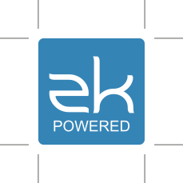
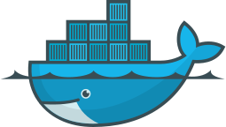
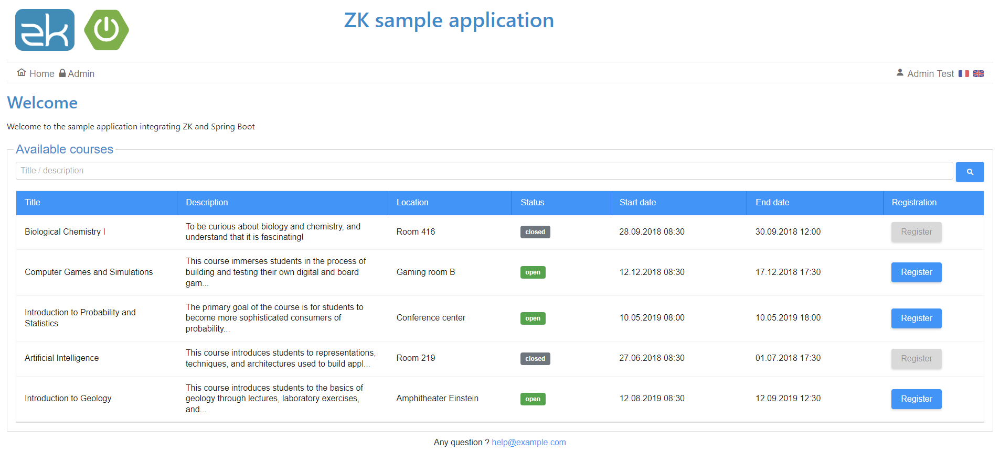
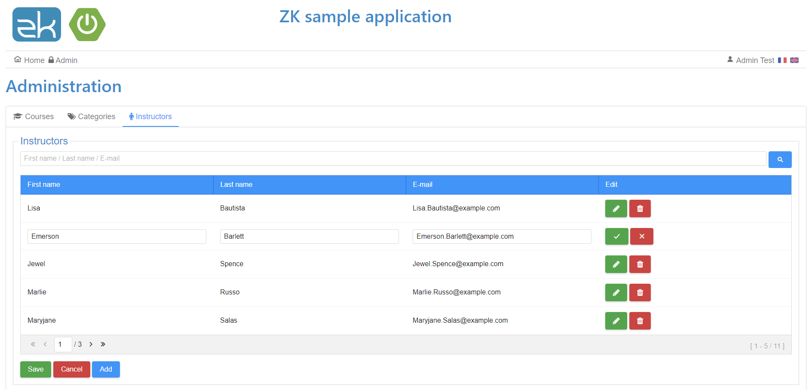
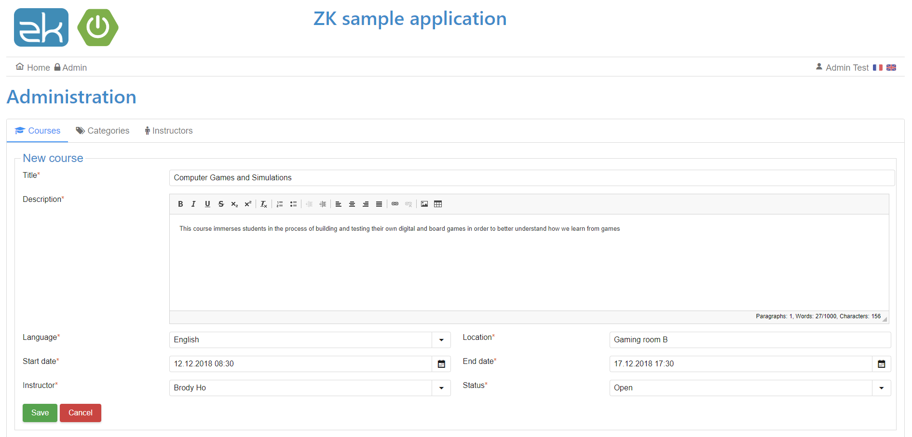

# ZK Spring Boot Example Application

Sample **Dockerized** application integrating **ZK** with **Spring Boot**.

---

# Table of Contents

* [About](#about)
* [Technologies](#technologies)
* [Functionalities](#functionalities)
* [Usage](#usage)
* [License](#license)

# About

<table>
  <tr>
    <td>
        
    </td>
    <td>
        
    </td>
    <td>
        
    </td>
    <td>
        
    </td>
    <td>
        
    </td>
    <td>
        
    </td>
  </tr>
</table>

This project is a sample course management application intended to demonstrate the use of the **ZK** Java web framework (https://www.zkoss.org/) through MVVM,
in a minimal "real world" application connected to a database.

It provides Docker configuration for rapid deployment.

# Technologies

- Docker (Compose 3.5)
- Java 11
- Spring Boot 2.1.0 (Undertow 2)
- Apache 2.4.37 with SSL and HTTP/2
- MariaDB 10.3
- JPA/Hibernate 5.3
- ZK 8.6.0
- Bootstrap 4.1.3

# Functionalities

The application mainly offers the following functionalities :

- Multilingual interface (FR / EN)
- Course listing with paging, sorting and filtering capabilities
- Administration interface allowing to :
  - List / add / edit / delete instructors
  - List / add / edit / delete categories
  - List / add / edit / delete courses

It uses main ZK components like tab boxes, grids, list boxes, group boxes, text boxes, buttons, dropdown lists, date pickers, CKEditor, ...

For CKEditor, I've added 2 plugins, `notification` and `wordcount` to display live information about number of words / characters in the editor footer.

The administration area is not restricted, admin user information are hardcoded in the related viewmodel, but you would of course retrieve this from a real authentication system.

Here are some screenshots :

### Home page (course list)

### Administration interface (modifying instructor)

### Administration interface (creating course)

# Usage

1. Run `docker-compose up` from the root folder, you should end up with 3 running containers :
   - _zk-spring-boot-example_apache_ : Apache
   - _zk-spring-boot-example_app_ : Application server (Undertow) with SSL (https), and JPDA (debug) configured
   - _zk-spring-boot-example_mariadb_ : MariaDB database
2. Build the project to create the JAR file
3. Reach https://localhost/zk-spring-boot-example

The database will be initialized with some data (from the _data.sql_ file) thanks to the **JPA** initialization mode.

> [!Warning]
> You may have to update the Apache version (line `wget https://www.apache.org/dist/httpd/httpd-2.4.58.tar.gz`
> in the Dockerfile (_docker\apache\Dockerfile_) if it does not exist anymore.

# License

[General Public License (GPL) v3](https://www.gnu.org/licenses/gpl-3.0.en.html)

This program is free software: you can redistribute it and/or modify it under the terms of the GNU
General Public License as published by the Free Software Foundation, either version 3 of the
License, or (at your option) any later version.

This program is distributed in the hope that it will be useful, but WITHOUT ANY WARRANTY; without
even the implied warranty of MERCHANTABILITY or FITNESS FOR A PARTICULAR PURPOSE. See the GNU
General Public License for more details.
    
You should have received a copy of the GNU General Public License along with this program.  If not,
see <http://www.gnu.org/licenses/>.